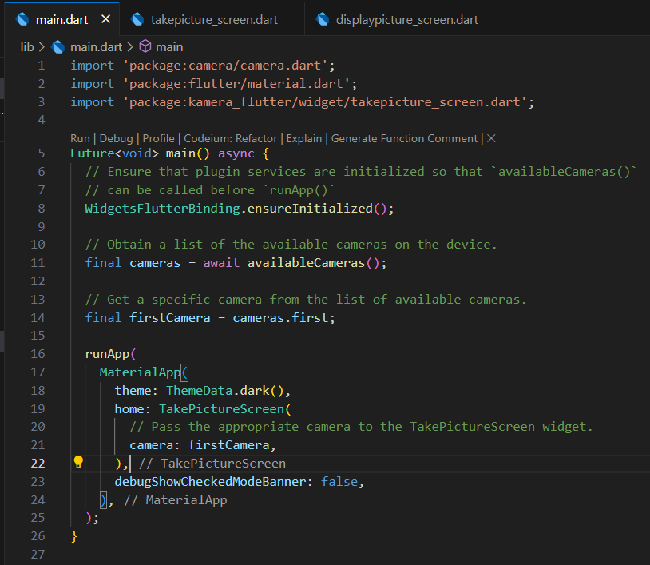

# kamera_flutter

A new Flutter project.

    Nama: Cinthya Achwatul Ifnu
    NIM: 2241720051
    Kelas: TI 3H
    No: 07

## Praktikum 1: Mengambil Foto dengan Kamera di Flutter
### Langkah 1: Buat Project Baru
Buatlah sebuah project flutter baru dengan nama kamera_flutter, lalu sesuaikan style laporan praktikum yang Anda buat.

### Langkah 2: Tambah dependensi yang diperlukan
Anda memerlukan tiga dependensi pada project flutter untuk menyelesaikan praktikum ini.

camera → menyediakan seperangkat alat untuk bekerja dengan kamera pada device.

path_provider → menyediakan lokasi atau path untuk menyimpan hasil foto.

path → membuat path untuk mendukung berbagai platform.

Untuk menambahkan dependensi plugin, jalankan perintah flutter pub add

### Langkah 3: Ambil Sensor Kamera dari device
Selanjutnya, kita perlu mengecek jumlah kamera yang tersedia pada perangkat menggunakan plugin camera seperti pada kode berikut ini. Kode ini letakkan dalam void main().

### Langkah 4: Buat dan inisialisasi CameraController
Setelah Anda dapat mengakses kamera, gunakan langkah-langkah berikut untuk membuat dan menginisialisasi CameraController. Pada langkah berikut ini, Anda akan membuat koneksi ke kamera perangkat yang memungkinkan Anda untuk mengontrol kamera dan menampilkan pratinjau umpan kamera.

1. Buat StatefulWidget dengan kelas State pendamping.
2. Tambahkan variabel ke kelas State untuk menyimpan CameraController.
3. Tambahkan variabel ke kelas State untuk menyimpan Future yang dikembalikan dari CameraController.initialize().
4. Buat dan inisialisasi controller dalam metode initState().
5. Hapus controller dalam metode dispose().

### Langkah 5: Gunakan CameraPreview untuk menampilkan preview foto
Gunakan widget CameraPreview dari package camera untuk menampilkan preview foto. Anda perlu tipe objek void berupa FutureBuilder untuk menangani proses async.

### Langkah 6: Ambil foto dengan CameraController
Pada codelab ini, buatlah sebuah FloatingActionButton yang digunakan untuk mengambil gambar menggunakan CameraController saat pengguna mengetuk tombol.

Pengambilan gambar memerlukan 2 langkah:

Pastikan kamera telah diinisialisasi.
Gunakan controller untuk mengambil gambar dan pastikan ia mengembalikan objek Future.
Praktik baik untuk membungkus operasi kode ini dalam blok try / catch guna menangani berbagai kesalahan yang mungkin terjadi.

### Langkah 7: Buat widget baru DisplayPictureScreen

### Langkah 8: Edit main.dart

### Langkah 9: Menampilkan hasil foto

### Hasil Output Praktikum 1

  
## Praktikum 2: Membuat photo filter carousel

### Langkah 1: Buat project baru
Buatlah project flutter baru di pertemuan 09 dengan nama photo_filter_carousel

### Langkah 2: Buat widget Selector ring dan dark gradient

### Langkah 3: Buat widget photo filter carousel

### Langkah 4: Membuat filter warna - bagian 1

### Langkah 5: Membuat filter warna

### Langkah 6: Implementasi filter carousel

### Hasil Output Praktikum 2

## Tugas Praktikum
Gabungkan hasil praktikum 1 dengan hasil praktikum 2 sehingga setelah melakukan pengambilan foto, dapat dibuat filter carouselnya!

### Modifikasi file main.dart

### Modifikasi file takepicture_screen.dart

### Modifikasi file dailypicture_screen.dart

### menambahkan file carousel_flowdelegate.dart

### memodifikasi file filter_carousel.dart

### memodifikasi file filter_item.dart

### memodifikasi file filter_selector.dart

### Hasil Output Tugas Praktikum

Tampilan kamera sebelum dilakukan pengambilan foto

Tampilan gambar setelah dilakukan pengambilan foto, terdapat filter carouselnya

## Pertanyaan
2. Jelaskan maksud void async pada praktikum 1?
    Dalam Dart (bahasa yang digunakan oleh Flutter), kata kunci async digunakan untuk menandai bahwa sebuah fungsi akan menjalankan operasi asinkron (non-blok) yang mungkin membutuhkan waktu untuk diselesaikan, seperti mengambil data dari internet, membaca file, atau operasi IO lainnya.

    Ketika sebuah fungsi diberi tanda async, itu berarti Anda dapat menggunakan await di dalam fungsi tersebut. await akan "menunggu" hingga operasi selesai tanpa menghalangi jalannya kode lain. Biasanya, fungsi asinkron mengembalikan Future, tapi jika fungsi tidak mengembalikan nilai apapun, Anda dapat mendeklarasikannya sebagai void async.

3. Jelaskan fungsi dari anotasi @immutable dan @override ?
    - Anotasi @immutable digunakan untuk menandai bahwa semua properti dari sebuah kelas harus bersifat "immutable" (tidak dapat diubah) setelah objek dibuat. Ini berarti semua variabel atau properti dari kelas tersebut harus bersifat final.

        Di Flutter, ini penting karena banyak kelas adalah stateless widgets yang seharusnya tidak berubah setelah dibuat. Anotasi @immutable akan membantu menangkap kesalahan secara dini jika Anda mencoba mengubah properti setelah objek diciptakan.

    - Anotasi @override digunakan ketika sebuah fungsi di dalam kelas menimpa (override) fungsi dengan nama dan parameter yang sama dari superclass atau antarmuka yang diimplementasikan. Ini membantu memastikan bahwa fungsi yang Anda coba timpa benar-benar ada di superclass, dan jika tidak ada, compiler akan memberikan peringatan atau kesalahan.

        Contoh paling umum di Flutter adalah menimpa metode build di dalam StatelessWidget atau State dari StatefulWidget.