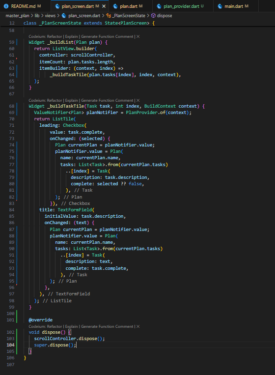

# Manajemen State

A new Flutter project.

    Nama: Cinthya Achwatul Ifnu
    NIM: 2241720051
    Kelas: TI 3H
    No: 07

## Praktikum 1: Dasar State dengan Model-View
### Langkah 1: Buat Project Baru
Buatlah sebuah project flutter baru dengan nama master_plan di folder src week-10 repository GitHub Anda atau sesuai style laporan praktikum yang telah disepakati. Lalu buatlah susunan folder dalam project seperti gambar berikut ini.

 

### Langkah 2: Membuat model task.dart
Di folder model, buat file bernama task.dart dan buat class Task. Class ini memiliki atribut description dengan tipe data String dan complete dengan tipe data Boolean, serta ada konstruktor. Kelas ini akan menyimpan data tugas untuk aplikasi kita.

 

### Langkah 3: Buat file plan.dart
Kita juga perlu sebuah List untuk menyimpan daftar rencana dalam aplikasi to-do ini. Buat file plan.dart di dalam folder models.

 

### Langkah 4: Buat file data_layer.dart
Kita dapat membungkus beberapa data layer ke dalam sebuah file yang nanti akan mengekspor kedua model tersebut. Dengan begitu, proses impor akan lebih ringkas seiring berkembangnya aplikasi. Buat file bernama data_layer.dart di folder models.

 

### Langkah 5: Pindah ke file main.dart

 

### Langkah 6: buat plan_screen.dart
Pada folder views, buatlah sebuah file plan_screen.dart dan gunakan templat StatefulWidget untuk membuat class PlanScreen. Isi kodenya adalah sebagai berikut. Gantilah teks ‘Namaku' dengan nama panggilan Anda pada title AppBar.

 

### Langkah 7: buat method _buildAddTaskButton()
Ayo kita buat mulai dari yang paling mudah yaitu tombol Tambah Rencana. Tambah kode berikut di bawah method build di dalam class _PlanScreenState.

 

### Langkah 8: buat widget _buildList()
Kita akan buat widget berupa List yang dapat dilakukan scroll, yaitu ListView.builder. Buat widget ListView seperti kode berikut ini.

 

### Langkah 9: buat widget _buildTaskTile
Dari langkah 8, kita butuh ListTile untuk menampilkan setiap nilai dari plan.tasks. Kita buat dinamis untuk setiap index data, sehingga membuat view menjadi lebih mudah. Tambahkan kode berikut ini.

 

Run atau tekan F5 untuk melihat hasil aplikasi yang Anda telah buat. Capture hasilnya untuk soal praktikum nomor 4.

 

### Langkah 10: Tambah Scroll Controller
Anda dapat menambah tugas sebanyak-banyaknya, menandainya jika sudah beres, dan melakukan scroll jika sudah semakin banyak isinya. Namun, ada salah satu fitur tertentu di iOS perlu kita tambahkan. Ketika keyboard tampil, Anda akan kesulitan untuk mengisi yang paling bawah. Untuk mengatasi itu, Anda dapat menggunakan ScrollController untuk menghapus focus dari semua TextField selama event scroll dilakukan. Pada file plan_screen.dart, tambahkan variabel scroll controller di class State tepat setelah variabel plan.

 

### Langkah 11: Tambah Scroll Listener
Tambah Scroll Listener

 

### Langkah 12: Tambah controller dan keyboard behavior
Tambahkan controller dan keyboard behavior pada ListView di method _buildList

 

### Langkah 13: Terakhir, tambah method dispose()
Terakhir, tambahkan method dispose() berguna ketika widget sudah tidak digunakan lagi.

 

### Langkah 14: Hasil

 

### Tugas Praktikum 1: Dasar State dengan Model-View
1. Selesaikan langkah-langkah praktikum tersebut, lalu dokumentasikan berupa GIF hasil akhir praktikum beserta penjelasannya di file README.md! Jika Anda menemukan ada yang error atau tidak berjalan dengan baik, silakan diperbaiki.
2. Jelaskan maksud dari langkah 4 pada praktikum tersebut! Mengapa dilakukan demikian?
    - File `data_layer.dart` dalam folder `models` bertujuan untuk mengumpulkan dan mengekspor semua model data dalam satu lokasi. Dengan cara ini, proses impor menjadi lebih sederhana, dan struktur kode lebih mudah dipahami saat aplikasi semakin kompleks. Langkah ini memungkinkan pengelolaan data menjadi lebih efektif dan ringkas, sehingga mendukung kelancaran dalam pengembangan aplikasi.

3. Mengapa perlu variabel plan di langkah 6 pada praktikum tersebut? Mengapa dibuat konstanta ?
    - Variabel `plan` di dalam `plan_screen.dart` berfungsi sebagai tempat penyimpanan instance model `Plan`, yang merepresentasikan rencana atau daftar tugas dalam aplikasi. Menambahkan konstanta pada inisialisasi `plan` membuat objek `Plan` menjadi tetap dan tidak dapat diubah setelah pembuatan. Langkah ini efektif untuk menjaga agar nilai `plan` tetap stabil, menghindari perubahan yang tidak diinginkan, dan menjamin konsistensi data di level aplikasi.

4. Lakukan capture hasil dari Langkah 9 berupa GIF, kemudian jelaskan apa yang telah Anda buat!

    Aplikasi ini menyediakan fitur menambahkan rencana untuk membuat daftar rencana pengguna. Pengguna juga dapat menandai setiap tugas yang telah selesai atau belum, serta melakukan scrolling pada daftar tugas yang telah dibuat. 

    

5. Apa kegunaan method pada Langkah 11 dan 13 dalam lifecyle state ?
    - `initState()`: digunakan untuk melakukan inisialisasi objek state sebelum widget dirender. Metode ini hanya dijalankan satu kali, yaitu saat widget pertama kali dibuat. Cocok untuk melakukan pengaturan awal atau menginisialisasi variabel yang diperlukan.

    - `dispose()`: dipanggil ketika objek state akan dihapus dari widget tree, misalnya saat widget dihapus dari tampilan atau ketika widget induk dihilangkan.

6. Kumpulkan laporan praktikum Anda berupa link commit atau repository GitHub ke dosen yang telah disepakati !

 

## Praktikum 2: Mengelola Data Layer dengan InheritedWidget dan InheritedNotifier
### Langkah 1: Buat file plan_provider.dart
Buat folder baru provider di dalam folder lib, lalu buat file baru dengan nama plan_provider.dart.

 

### Langkah 2: Edit main.dart
Gantilah pada bagian atribut home dengan PlanProvider seperti berikut. Jangan lupa sesuaikan bagian impor jika dibutuhkan.

 

### Langkah 3: Tambah method pada model plan.dart
Tambahkan dua method di dalam model class Plan.

 

### Langkah 4: Pindah ke PlanScreen
Edit PlanScreen agar menggunakan data dari PlanProvider. Hapus deklarasi variabel plan (ini akan membuat error). Kita akan perbaiki pada langkah 5 berikut ini.

 

 

### Langkah 5: Edit method _buildAddTaskButton
Tambahkan BuildContext sebagai parameter dan gunakan PlanProvider sebagai sumber datanya.

 

### Langkah 6: Edit method _buildTaskTile
Tambahkan parameter BuildContext, gunakan PlanProvider sebagai sumber data. Ganti TextField menjadi TextFormField untuk membuat inisial data provider menjadi lebih mudah.

 

### Langkah 7: Edit _buildList
Sesuaikan parameter pada bagian _buildTaskTile

 

### Langkah 8: Tetap di class PlanScreen
Edit method build sehingga bisa tampil progress pada bagian bawah (footer). Caranya, bungkus (wrap) _buildList dengan widget Expanded dan masukkan ke dalam widget Column seperti kode pada Langkah 9.

 

### Langkah 9: Tambah widget SafeArea
Terakhir, tambahkan widget SafeArea dengan berisi completenessMessage pada akhir widget Column.

 

### Hasil

 

## Tugas Praktikum 2: InheritedWidget
1. Selesaikan langkah-langkah praktikum tersebut, lalu dokumentasikan berupa GIF hasil akhir praktikum beserta penjelasannya di file README.md! Jika Anda menemukan ada yang error atau tidak berjalan dengan baik, silakan diperbaiki sesuai dengan tujuan aplikasi tersebut dibuat.

2. Jelaskan mana yang dimaksud InheritedWidget pada langkah 1 tersebut! Mengapa yang digunakan InheritedNotifier?
    - `PlanProvider` adalah sebuah kelas yang diturunkan dari `InheritedNotifier<ValueNotifier<Plan>>`. `InheritedWidget` memungkinkan widget di dalamnya untuk mengakses data atau memantau perubahan tanpa memerlukan data tersebut sebagai parameter eksplisit. `InheritedNotifier` digunakan di sini karena `ValueNotifier` berfungsi sebagai bagian dari `InheritedWidget`. Dengan `InheritedNotifier`, konsep `InheritedWidget` dan `Listenable` (seperti `ValueNotifier`) digabungkan, memungkinkan widget turunan mendeteksi perubahan secara otomatis dan melakukan rebuild saat data yang diawasi diperbarui.

3. Jelaskan maksud dari method di langkah 3 pada praktikum tersebut! Mengapa dilakukan demikian?
    - Method completedCount() pada kelas Plan berperan dalam menghitung jumlah tugas yang sudah selesai, yaitu tugas dengan atribut complete yang bernilai true. Sementara itu, method completenessMessage() menghasilkan pesan yang menggambarkan kemajuan dalam menyelesaikan tugas, dengan menunjukkan jumlah tugas yang telah diselesaikan dibandingkan total tugas yang ada. Kedua method ini membantu memberikan pandangan yang jelas tentang progres rencana, sehingga memudahkan pengguna untuk memahami seberapa banyak tugas dalam rencana tersebut telah terselesaikan.

4. Lakukan capture hasil dari Langkah 9 berupa GIF, kemudian jelaskan apa yang telah Anda buat!
    - Dalam praktikum ini, terdapat peningkatan dalam manajemen data dan pengelolaan state aplikasi, seperti modifikasi pada file `main`, penambahan `PlanProvider` sebagai penyedia data yang menggantikan penggunaan variabel `plan`, pembaruan pada model `Plan`, dan perubahan pada `PlanScreen`.  
    Catatan: Hasilnya dapat dilihat pada praktikum 2.

5. Kumpulkan laporan praktikum Anda berupa link commit atau repository GitHub ke dosen yang telah disepakati !

## Praktikum 3: Membuat State di Multiple Screens
### Langkah 1: Edit PlanProvider
Perhatikan kode berikut, edit class PlanProvider sehingga dapat menangani List Plan.

 

### Langkah 2: Edit main.dart
Langkah sebelumnya dapat menyebabkan error pada main.dart dan plan_screen.dart.

 

### Langkah 3: Edit plan_screen.dart
Tambahkan variabel plan dan atribut pada constructor

 

### Langkah 4: Error
Itu akan terjadi error setiap kali memanggil PlanProvider.of(context). Itu terjadi karena screen saat ini hanya menerima tugas-tugas untuk satu kelompok Plan, tapi sekarang PlanProvider menjadi list dari objek plan tersebut.

### Langkah 5: Tambah getter Plan
Tambahkan getter pada _PlanScreenState seperti kode berikut.

 

### Langkah 6: Method initState()

 

### Langkah 7: Widget build
Pastikan Anda telah merubah ke List dan mengubah nilai pada currentPlan

 

### Langkah 8: Edit _buildTaskTile
Pastikan ubah ke List dan variabel planNotifier

 

### Langkah 9: Buat screen baru
Pada folder view, buatlah file baru dengan nama plan_creator_screen.dart dan deklarasikan dengan StatefulWidget bernama PlanCreatorScreen. Gantilah di main.dart pada atribut home

- file Plan_creator_screen.dart

- file main.dart

 

### Langkah 10: Pindah ke class _PlanCreatorScreenState
Kita perlu tambahkan variabel TextEditingController sehingga bisa membuat TextField sederhana untuk menambah Plan baru. Jangan lupa tambahkan dispose ketika widget unmounted

 

### Langkah 11: Pindah ke method build
Letakkan method Widget build berikut di atas void dispose. Gantilah ‘Namaku' dengan nama panggilan Anda.

 

### Langkah 12: Buat widget _buildListCreator
Buatlah widget berikut setelah widget build.

 

### Langkah 13: Buat void addPlan()
Tambahkan method berikut untuk menerima inputan dari user berupa text plan.

 

### Langkah 14: Buat widget _buildMasterPlans()

 

Terakhir, run atau tekan F5 untuk melihat hasilnya jika memang belum running. Bisa juga lakukan hot restart jika aplikasi sudah running. Maka hasilnya akan seperti gambar berikut ini.

 

## Tugas Praktikum 3: State di Multiple Screens
1. Selesaikan langkah-langkah praktikum tersebut, lalu dokumentasikan berupa GIF hasil akhir praktikum beserta penjelasannya di file README.md! Jika Anda menemukan ada yang error atau tidak berjalan dengan baik, silakan diperbaiki sesuai dengan tujuan aplikasi tersebut dibuat.
2. Berdasarkan Praktikum 3 yang telah Anda lakukan, jelaskan maksud dari gambar diagram berikut ini!

    Diagram ini menjelaskan dua layar utama dalam aplikasi Flutter, yaitu **PlanCreatorScreen** sebagai layar untuk membuat rencana dan **PlanScreen** sebagai layar detail rencana. Diagram ini juga menunjukkan bagaimana aplikasi berpindah antar layar menggunakan `Navigator.push`.

    **Layar Kiri - PlanCreatorScreen**:

    - Merupakan layar awal di mana pengguna dapat membuat dan melihat daftar rencana.  
    - **MaterialApp** digunakan sebagai root yang membungkus seluruh widget aplikasi.  
    - **PlanProvider** bertugas untuk mengelola data rencana agar dapat digunakan di berbagai bagian aplikasi.  
    - **PlanCreatorScreen** menyediakan fitur:  
    - **TextField** untuk menulis nama rencana baru.  
    - **ListView** yang berada di dalam **Expanded** untuk menampilkan daftar rencana yang sudah dibuat.  

    **Proses Navigasi - Navigator Push**:  

    - Ketika pengguna memilih salah satu rencana di **PlanCreatorScreen**, aplikasi menggunakan `Navigator.push` untuk membuka layar baru, yaitu **PlanScreen**.  
    - `Navigator.push` memungkinkan pengguna berpindah ke layar detail rencana yang dipilih.  

    **Layar Kanan - PlanScreen**:  

    - Berfungsi untuk menampilkan detail rencana yang dipilih oleh pengguna.  
    - **PlanScreen** menyajikan informasi rencana tertentu, dengan komponen seperti:  
    - **ListView** untuk menampilkan daftar tugas terkait rencana tersebut.  
    - **SafeArea** dengan teks yang menunjukkan status atau progres rencana.  

    Dengan ini, diagram menggambarkan dua layar utama beserta alur navigasi dan perpindahan data antar layar.

3. Lakukan capture hasil dari Langkah 14 berupa GIF, kemudian jelaskan apa yang telah Anda buat!

    

4. Kumpulkan laporan praktikum Anda berupa link commit atau repository GitHub ke dosen yang telah disepakati !

