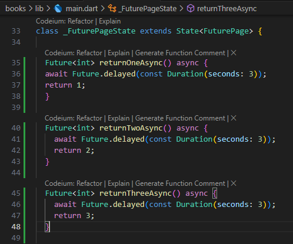

# Pemrograman Asynchronous di Flutter
A new Flutter project.

    Nama: Cinthya Achwatul Ifnu
    NIM: 2241720051
    Kelas: TI 3H
    No: 07

## Praktikum 1: Mengunduh Data dari Web Service (API)
### Langkah 1: Buat Project Baru
Buatlah sebuah project flutter baru dengan nama books di folder src week-11 repository GitHub Anda.

Kemudian Tambahkan dependensi http dengan mengetik perintah berikut di terminal.

 

### Langkah 2: Cek file pubspec.yaml
Jika berhasil install plugin, pastikan plugin http telah ada di file pubspec

 

### Langkah 3: Buka file main.

#### Soal 1
Tambahkan nama panggilan Anda pada title app sebagai identitas hasil pekerjaan Anda.

 

 

### Langkah 4: Tambah method getData()
Tambahkan method ini ke dalam class _FuturePageState yang berguna untuk mengambil data dari API Google Books.

 

### Soal 2
- Carilah judul buku favorit Anda di Google Books, lalu ganti ID buku pada variabel path di kode tersebut. Caranya ambil di URL browser Anda seperti gambar berikut ini.

 

- Kemudian cobalah akses di browser URI tersebut dengan lengkap seperti ini. Jika menampilkan data JSON, maka Anda telah berhasil. Lakukan capture milik Anda dan tulis di README pada laporan praktikum. Lalu lakukan commit dengan pesan "W11: Soal 2".

 

### Langkah 5: Tambah kode di ElevatedButton
Tambahkan kode pada onPressed di 

 

Lakukan run aplikasi Flutter Anda. Anda akan melihat tampilan akhir seperti gambar berikut. Jika masih terdapat error, silakan diperbaiki hingga bisa running.

### Soal 3
- Jelaskan maksud kode langkah 5 tersebut terkait substring dan catchError!

    Kode tersebut melakukan pengambilan data secara asinkron dengan tombol "GO!". Jika data berhasil didapat, string hasil dipotong hingga 450 karakter menggunakan substring dan ditampilkan. Jika terjadi kesalahan (misalnya jaringan gagal), catchError akan menangkap error, mengubah hasil menjadi 'An error occurred', lalu memperbarui UI. Intinya: substring memotong teks panjang, dan catchError menangani error untuk mencegah aplikasi crash.

- Capture hasil praktikum Anda berupa GIF dan lampirkan di README. Lalu lakukan commit dengan pesan "W11: Soal 3".

 

## Praktikum 2: Menggunakan await/async untuk menghindari callbacks
### Langkah 1: Buka file main.dart
Tambahkan tiga method berisi kode seperti berikut di dalam class _FuturePageState.

 

### Langkah 2: Tambah method count()
Lalu tambahkan lagi method ini di bawah ketiga method sebelumnya.

 

### Langkah 3: Panggil count()
Lakukan comment kode sebelumnya, ubah isi kode onPressed()

 

### Langkah 4: Run
Akhirnya, run atau tekan F5 jika aplikasi belum running. Maka Anda akan melihat seperti gambar berikut, hasil angka 6 akan tampil setelah delay 9 detik.

### Soal 4
- Jelaskan maksud kode langkah 1 dan 2 tersebut!

    **Langkah 1**: Fungsi dummy untuk mensimulasikan operasi asinkron (dengan waktu tunda 3 detik) yang mengembalikan nilai tetap.

    **Langkah 2**: Fungsi utama yang memanggil fungsi-fungsi asinkron tersebut satu per satu, menjumlahkan hasilnya, dan memperbarui UI dengan total.

- Capture hasil praktikum Anda berupa GIF dan lampirkan di README. Lalu lakukan commit dengan pesan "W11: Soal 4".

    
         

## Praktikum 3: Menggunakan Completer di Future
### Langkah 1: Buka main.dart
Pastikan telah impor package async

 

### Langkah 2: Tambahkan variabel dan method
Tambahkan variabel late dan method di class _FuturePageState

 

### Langkah 3: Ganti isi kode onPressed()
Tambahkan kode berikut pada fungsi onPressed(). Kode sebelumnya bisa Anda comment.

### Langkah 4:
Terakhir, run atau tekan F5 untuk melihat hasilnya jika memang belum running. Bisa juga lakukan hot restart jika aplikasi sudah running. Maka hasilnya akan seperti gambar berikut ini. Setelah 5 detik, maka angka 42 akan tampil.

  

### Soal 5
- Jelaskan maksud kode langkah 2 tersebut!

    Kode tersebut adalah fungsi asinkron count yang menghitung total dari hasil tiga operasi asinkron (returnOneAsync, returnTwoAsync, returnThreeAsync). Fungsi ini menunggu setiap operasi selesai satu per satu menggunakan await, menjumlahkan hasilnya ke variabel total, lalu memperbarui UI dengan hasil total dalam bentuk string melalui setState.

- Capture hasil praktikum Anda berupa GIF dan lampirkan di README. Lalu lakukan commit dengan pesan "W11: Soal 5".

### Langkah 5: Ganti method calculate()
Gantilah isi code method calculate() seperti kode berikut, atau Anda dapat membuat calculate2()

 

### Langkah 6: Pindah ke onPressed()

 

### Soal 6
- Jelaskan maksud perbedaan kode langkah 2 dengan langkah 5-6 tersebut!

    Langkah 2: Menjalankan operasi asinkron satu per satu secara berurutan menggunakan await, menjumlahkan hasilnya, lalu memperbarui UI. Operasi selesai setelah semua tugas selesai.

    Langkah 5-6: Menggunakan completer untuk menyelesaikan operasi asinkron tunggal, memperbarui UI hanya setelah hasil dikembalikan, dan menangani error secara eksplisit. Proses lebih fokus pada satu tugas. 
    
- Capture hasil praktikum Anda berupa GIF dan lampirkan di README. Lalu lakukan commit dengan pesan "W11: Soal 6".

    
      

 

## Praktikum 4: Memanggil Future secara paralel
### Langkah 1: Buka file main.dart
Tambahkan method ini ke dalam class _FuturePageState

 

### Langkah 2: Edit onPressed()
Anda bisa hapus atau comment kode sebelumnya, kemudian panggil method dari langkah 1 tersebut.

 

### Langkah 3: Run
Anda akan melihat hasilnya dalam 3 detik berupa angka 6 lebih cepat dibandingkan praktikum sebelumnya menunggu sampai 9 detik.

### Soal 7
Capture hasil praktikum Anda berupa GIF dan lampirkan di README. Lalu lakukan commit dengan pesan "W11: Soal 7".

  

### Langkah 4: Ganti variabel futureGroup
Anda dapat menggunakan FutureGroup dengan Future.wait seperti kode berikut.

 

### Soal 8
Jelaskan maksud perbedaan kode langkah 1 dan 4!

**Langkah 1:**  
`FutureGroup` digunakan untuk mengelola beberapa `Future` dan menunggu hingga semuanya selesai. Anda dapat menambahkan `Future` menggunakan metode `add`, lalu harus memanggil `close()` setelah semua `Future` selesai ditambahkan agar proses dapat berjalan. Nilai yang dikembalikan berupa daftar hasil dari semua `Future` melalui properti `future`.  

**Langkah 4:**  
`Future.wait` memungkinkan Anda langsung memberikan daftar `Future` yang ingin dijalankan secara bersamaan. Tidak perlu menggunakan metode `add` atau memanggil `close()` seperti pada `FutureGroup`. Setelah semua `Future` selesai, hasilnya berupa daftar nilai dari masing-masing `Future`.  

Secara keseluruhan, `Future.wait` lebih sederhana dan cocok untuk digunakan jika semua proses sudah diketahui sejak awal. Sementara itu, `FutureGroup` lebih fleksibel untuk menambahkan `Future` secara bertahap, meskipun membutuhkan penanganan tambahan, seperti memanggil `close()`.

## Praktikum 5: Menangani Respon Error pada Async Code
### Langkah 1: Buka file main.dart
Tambahkan method ini ke dalam class _FuturePageState

 

### Langkah 2: ElevatedButton
Ganti dengan kode berikut

### Langkah 3: Run
Lakukan run dan klik tombol GO!

 

Pada bagian debug console akan melihat teks Complete seperti berikut.

 

### Soal 9
Capture hasil praktikum Anda berupa GIF dan lampirkan di README. Lalu lakukan commit dengan pesan "W11: Soal 9".

 

### Langkah 4: Tambah method handleError()
Tambahkan kode ini di dalam class _FutureStatePage

 

### Soal 10
Panggil method handleError() tersebut di ElevatedButton, lalu run. Apa hasilnya? Jelaskan perbedaan kode langkah 1 dan 4!

- Langkah 1 membuat method `returnError()` yang mensimulasikan error dengan menunda proses selama 2 detik sebelum melemparkan pesan error tanpa penanganan. Jika error terjadi, aplikasi berpotensi langsung crash.  

- Langkah 4, method `handleError()` ditambahkan untuk menangani error yang dihasilkan oleh `returnError()` menggunakan try-catch-finally. Di dalam blok catch, error ditangkap dan ditampilkan ke UI melalui `setState`. Blok finally memastikan kode tetap dieksekusi, seperti mencetak pesan "Complete". Langkah ini membuat aplikasi lebih stabil dan responsif meskipun terjadi error.

## Praktikum 6: Menggunakan Future dengan StatefulWidget
### Langkah 1: install plugin geolocator
Tambahkan plugin geolocator dengan mengetik perintah berikut di terminal.

 

### Langkah 2: Tambah permission GPS
Jika Anda menargetkan untuk platform Android, maka tambahkan baris kode berikut di file

 

### Langkah 3: Buat file geolocation.dart
Tambahkan file baru ini di folder lib project Anda.

 

### Langkah 4: Buat StatefulWidget
Buat class LocationScreen di dalam file geolocation.dart

 

### Langkah 5: Isi kode geolocation.dart

 

### Soal 11
Tambahkan nama panggilan Anda pada tiap properti title sebagai identitas pekerjaan Anda.

 

### Langkah 6: Edit main.dart
Panggil screen baru tersebut di file main Anda seperti berikut.

 

### Langkah 7: Run
Run project Anda di device atau emulator (bukan browser), maka akan tampil seperti berikut ini.

 

### Langkah 8: Tambahkan animasi loading
Tambahkan widget loading seperti kode berikut. Lalu hot restart, perhatikan perubahannya.

 

### Soal 12
- Jika Anda tidak melihat animasi loading tampil, kemungkinan itu berjalan sangat cepat. Tambahkan delay pada method getPosition() dengan kode await Future.delayed(const Duration(seconds: 3));
- Apakah Anda mendapatkan koordinat GPS ketika run di browser? Mengapa demikian?

    Saat menjalankan aplikasi di browser, koordinat GPS tetap dapat diperoleh karena browser mendukung fitur geolokasi. Fitur ini memanfaatkan API lokasi bawaan yang mengambil data dari sumber seperti jaringan Wi-Fi atau lokasi IP, sehingga tidak memerlukan akses langsung ke perangkat keras GPS. Oleh sebab itu, koordinat lokasi tetap dapat diakses meskipun aplikasi dijalankan melalui browser.

- Capture hasil praktikum Anda berupa GIF dan lampirkan di README. Lalu lakukan commit dengan pesan "W11: Soal 12".

## Praktikum 7: Manajemen Future dengan FutureBuilder
### Langkah 1: Modifikasi method getPosition()
Buka file geolocation.dart kemudian ganti isi method dengan kode ini.

 

### Langkah 2: Tambah variabel
Tambah variabel ini di class _LocationScreenState

 

### Langkah 3: Tambah initState()
Tambah method ini dan set variabel 

 

### Langkah 4: Edit method build()
Ketik kode berikut dan sesuaikan. Kode lama bisa Anda comment atau hapus.

 

### Soal 13
Apakah ada perbedaan UI dengan praktikum sebelumnya? Mengapa demikian?

    Dari segi tampilan, tidak ada perbedaan yang terlihat karena kedua kode menghasilkan elemen yang sama, seperti CircularProgressIndicator untuk proses loading dan Text untuk menampilkan hasil lokasi. Struktur UI seperti Scaffold, AppBar, dan tata letak lainnya juga tetap sama. Namun, perbedaan utama terletak pada logika di balik kode, di mana pada praktikum ini digunakan FutureBuilder untuk mengelola data serta menangani error dengan lebih baik. Jadi, meskipun tampilannya serupa, kode yang diperbarui lebih terorganisir, efisien, dan mampu menangani masalah secara lebih optimal.

Capture hasil praktikum Anda berupa GIF dan lampirkan di README. Lalu lakukan commit dengan pesan "W11: Soal 13".
Seperti yang Anda lihat, menggunakan FutureBuilder lebih efisien, clean, dan reactive dengan Future bersama UI.

 

### Langkah 5: Tambah handling error
Tambahkan kode berikut untuk menangani ketika terjadi error. Kemudian hot restart.

### Soal 14
Apakah ada perbedaan UI dengan langkah sebelumnya? Mengapa demikian?

     Setelah menambahkan error handling dan melakukan hot restart, tampilan UI tidak akan berbeda selama proses pengambilan lokasi berhasil tanpa kendala. Aplikasi tetap menampilkan **CircularProgressIndicator** saat loading dan menampilkan data lokasi berupa latitude dan longitude jika berhasil. Namun, jika terjadi error, seperti penolakan izin lokasi atau layanan lokasi yang tidak aktif, UI akan menampilkan teks **"Something terrible happened!"**. Hal ini sebelumnya tidak ditangani sehingga hanya menghasilkan tampilan kosong dengan **Text('')**.
Capture hasil praktikum Anda berupa GIF dan lampirkan di README. Lalu lakukan commit dengan pesan "W11: Soal 14".

 

## Praktikum 8: Navigation route dengan Future Function

### Langkah 1: Buat file baru navigation_first.dart
Buatlah file baru ini di project lib Anda.

 

### Langkah 2: Isi kode navigation_first.dart

 

### Soal 15
Tambahkan nama panggilan Anda pada tiap properti title sebagai identitas pekerjaan Anda.
Silakan ganti dengan warna tema favorit Anda.

### Langkah 3: Tambah method di class _NavigationFirstState

 

### Langkah 4: Buat file baru navigation_second.dart
Buat file baru ini di project lib Anda. Silakan jika ingin mengelompokkan view menjadi satu folder dan sesuaikan impor yang dibutuhkan.

 

### Langkah 5: Buat class NavigationSecond dengan StatefulWidget

 

### Langkah 6: Edit main.dart
Lakukan edit properti home.

 

Langkah 8: Run
Lakukan run, jika terjadi error silakan diperbaiki.

 

### Soal 16
Cobalah klik setiap button, apa yang terjadi ? Mengapa demikian ?

    Yang terjadi ketika saya klik setiap button, maka button tersebut menampilkan background dengan warna yang sesuai dengan warna yang diinputkan pada button tersebut. 

    Saat tombol **Red**, **Green**, atau **Blue** di layar kedua diklik, warna yang dipilih (merah, hijau, atau biru) akan diterapkan, layar kedua akan tertutup, dan layar pertama akan kembali dengan latar belakang yang berubah sesuai warna pilihan. Namun, jika tidak ada warna yang dipilih dan tombol **Change Color** ditekan, layar kedua akan tertutup tanpa mengubah warna latar belakang.
    
Gantilah 3 warna pada langkah 5 dengan warna favorit Anda!
Capture hasil praktikum Anda berupa GIF dan lampirkan di README. Lalu lakukan commit dengan pesan "W11: Soal 16".

 